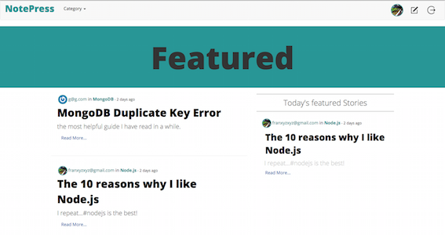
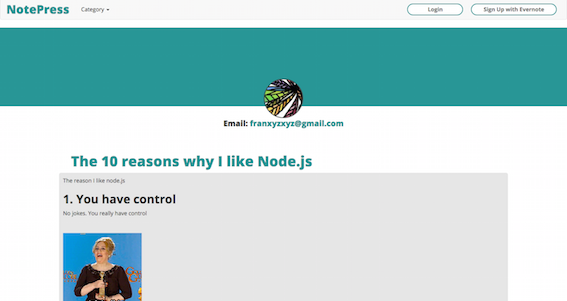
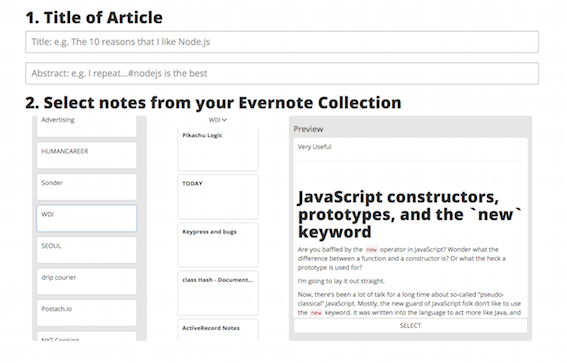
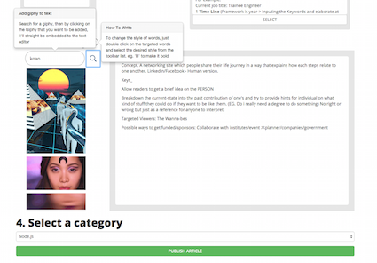

# NotePress

### What is this?

NotePress is an article publishing platform for junior web-developers to share their works or interesting findings. Users can connect their Evernote account to fetch notes and use the text-editor on the platform to add contents on top of the note contents

### How to use this?
1. Without an account, user can read all the articles on NotePress through different category of stacks.

2. Also, user can read a particular author's list of articles through dashboard and leave comments if they are logged in

3. User can register and grant authorization on Evernote for NotePress. To create an article, user can first see their notebook lists on Evernote, and then fetch the contents of the notes by browsing through the GUI in the app.

4. After selecting the notes from Evernote, user can edit the content with the text-editor (incorporated with Medium.js) and add extra features eg. [Giphy](http://giphy.com) through the search bar.

### Technologies
 - [Node.js](https://nodejs.org/), [MongoDB](https://www.mongodb.org/), [Express](http://expressjs.com/)
 - [Evernote SDK](https://dev.evernote.com/doc/)
 - [Passport](http://passportjs.org/)
 - [Medium.js](http://jakiestfu.github.io/Medium.js/docs/) - A JS library that makes `contenteditable` content juicy
 - [Moment.js](http://momentjs.com/) - A JS library that manipulates dates
 - Other 3rd Party APIs: [Giphy](https://api.giphy.com/), [StackExchange](https://api.stackexchange.com/docs)